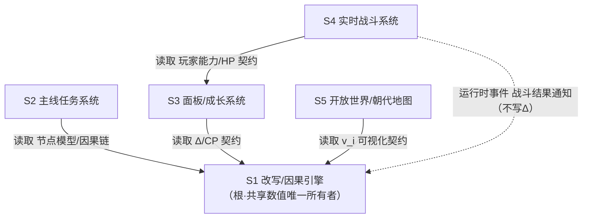
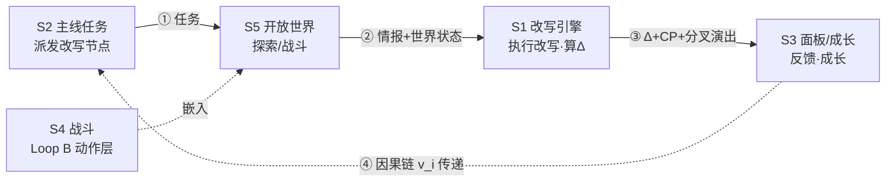

# 系统总索引 · 《赤壁·改写者》垂直切片

> 阶段：Phase 2 · 系统设计（P2-1）　|　执行角色：文策渊（design-strategist）
> 文档版本：v0.1（首版，待主创评审）　|　状态：可评审
> 基线锚点：`AGENTS.md`「设计基线」表、`docs/project-charter.md`、`docs/roadmap.md`
> 设计依赖：`docs/design/gdd/game-concept.md`（P1-1，已交付）——本索引的**支柱名 / 核心循环措辞 / 术语全部沿用其定义**，保持跨文档一致。
> 美术约束：`docs/design/art/art-bible.md`（P1-2，已交付）——系统面板须遵循「双轨反差 / 系统材质规范」（见第 6 节横切）。
> 本文件是 Phase 2 的**目录页 + 依赖骨架**，先于各系统 GDD（P2-2~P2-6）落地，为它们划清边界、依赖与一致性基线。**本文件不展开任何系统的完整八节**——那是后续单的职责。

---

## 0. 文档定位与使用方式

- **作用**：垂直切片全部核心系统的「入口 + 依赖图 + 边界契约」。后续每个 GDD（P2-2~P2-6）开篇须声明「本系统边界以本索引第 2 节为准，术语以 `game-concept.md` 第 1 节为准」。
- **不是**：不定义任何系统的具体机制 / 数据 / 公式 / 数值（那归各系统 GDD 八节）；不臆造引擎 API。
- **阅读对象**：主创（评审范围 / 支柱对齐）、各专家（按第 7 节顺序撰写 / 评审 GDD）、程基岩（据此设计架构与数据归属）。
- **术语**：沿用 `game-concept.md` 第 1 节词汇表（历史偏差 Δ / 因果点 CP / 关键变量 v_i / 改写节点 / 因果链 / 历史线 / 系统），本文不重复定义，仅在需要时引用。

---

## 1. 系统清单

> 五大核心系统（roadmap P2-2~P2-6 对应）+ 支撑 / 横切系统。范围标注见第 1.2 节与 `game-concept.md` 第 7 节。

### 1.1 核心系统（全部进垂直切片）

| # | 系统 | 一句话职责 | 对应 GDD 路径 | 范围 |
|---|---|---|---|---|
| S1 | **改写/因果引擎** | 把玩家的改写动词翻译成可丈量的「历史偏差 Δ」并产出因果点 CP，是整个游戏的心脏。 | `systems/rewrite-causality.md`（P2-2） | 垂直切片核心 |
| S2 | **主线任务系统** | 以「系统」人格派发改写节点主线，管理节点生命周期与因果链传递。 | `systems/mainline-quest.md`（P2-3） | 垂直切片核心 |
| S3 | **面板/成长系统** | 把 Δ/CP/世界状态翻译成可读的系统面板，提供技能树/兑换/情报强化的成长出口。 | `systems/panel-progression.md`（P2-4） | 垂直切片核心 |
| S4 | **实时战斗系统** | 俯视角实时轻动作 ARPG（普攻+系统术法），为探索/改写提供动作层与微观风险（Loop B）。 | `systems/combat.md`（P2-5） | 垂直切片核心 |
| S5 | **开放世界/朝代地图系统** | 2D 俯视 `TileMapLayer` 的赤壁沙盘，产出情报/世界状态/NPC，并视觉化关键变量 v_i。 | `systems/open-world.md`（P2-6） | 垂直切片核心 |

### 1.2 支撑 / 横切系统（范围分级）

| # | 系统 | 一句话职责 | 归属 / 拆分建议 | 范围 |
|---|---|---|---|---|
| X1 | **系统叙事层（The System 旁白/演出）** | 系统作为「冷峻记录员」旁白、播报偏差、驱动历史线分叉演出。 | 横切：旁白文本归 S2（主线叙事）/ S1（Δ 反馈触发）；演出表现归 S3（面板）。人格基调待审批（game-concept §9①） | 垂直切片（MVP 最小旁白） |
| X2 | **NPC 关系系统** | 与核心名角（诸葛/曹操/周瑜/关羽）的师徒/敌友/策反关系，影响改写条件与结局。 | 倾向挂在 S5（开放世界 NPC 层）下作子系统；与 S1/S2 双向读写关系值 | 目标态（MVP 不做，架构预留） |
| X3 | **阵营系统** | 魏/蜀/吴三方阵营色、旗号、关系，影响遭遇与改写政治后果。 | S5 视觉侧（配色/旗号）已在；关系逻辑属 X2 / 愿景 | 愿景外（本切片仅视觉区分） |
| X4 | **存档/读档** | 持久化玩家进度、节点变量状态、面板成长。 | 工程侧（程基岩 P3）；设计侧只提「需存什么」 | 垂直切片（基础存档） |
| X5 | **设置 / 可访问性** | 输入、字幕、对比度、缩放（WCAG AA 目标）。 | 独立横切轨道（见 art-bible §6.3 / 可访问性矩阵 P3） | 垂直切片（基础） |
| X6 | **朝代热切换 / 跨朝代偏差累积** | 朝代 = TileSet + 遭遇表 + BGM 组合热切换。 | 愿景；架构不挡路（AGENTS.md 已铺路） | **明确不做**（game-concept §7.3） |

> 说明：X1~X5 是垂直切片必须顾及的横切关注点，但**不单独建 GDD**（除主理人派单）；它们的边界在对应核心系统 GDD 中以小节交代。X6 明确愿景外。

---

## 2. 系统职责边界（管什么 / 不管什么）

> 消除职责重叠。每个系统「管什么」是它的所有权，「不管什么」交给别人。

### S1 改写/因果引擎
- **管**：关键变量 v_i 的数据模型与取值；历史偏差 Δ 的计算公式与权重量表；因果点 CP 的产出公式；因果链（节点间 v_i 传递）规则；改写动词→v_i 改变的映射；重大偏差阈值 Δ_critical 与震荡机制。
- **不管**：节点何时被派发、主线顺序（→ S2）；Δ/CP 怎么显示与花掉（→ S3）；改写的物理执行（移动/战斗/潜行）（→ S4/S5）；世界长什么样、情报从哪来（→ S5）。

### S2 主线任务系统
- **管**：改写节点的派发时机与顺序；节点存在性依赖（如 N3 是否出现依赖 N2 结果，game-concept §6.3）；任务目标文案与「系统」派单语气；节点状态机（未激活/进行/已完成/已消失）。
- **不管**：节点内部 v_i 怎么算 Δ（→ S1）；任务目标的地理布置与触发器（→ S5）；完成后的成长发放（→ S3）。

### S3 面板/成长系统
- **管**：Δ/CP/世界状态的可视化呈现（系统面板、HUD）；CP 的账户与兑换（技能树/系统术法/情报强化）；玩家「改写能力」的升级数值；历史线分叉演出的表现层；意图匹配度（若设为玩家显式输入）的输入接口。
- **不管**：Δ/CP 怎么算出来（→ S1）；技能/术法的战斗执行（→ S4）；面板美术资产（→ 林绘澄，遵循 art-bible §6）。

### S4 实时战斗系统
- **管**：普攻/闪避/硬直/资源消耗的基础战斗规则；系统术法/技能的释放与命中；伤害公式；敌人 AI 基础行为；战斗内的「被发现/警戒」状态（影响改写难度，game-concept §5.3）。
- **不管**：战斗是否产出 Δ（**不直接产出**，game-concept §5.3 明确）；术法解锁与数值（→ S3 提供，S4 执行）；战场地理与遭遇布置（→ S5）；战斗结果如何改变 v_i（通过事件通知 S1，由 S1 判定，S4 不自算 Δ）。

### S5 开放世界/朝代地图系统
- **管**：`TileMapLayer` 赤壁地图拼贴与据点（夏口/乌林/赤壁/华容道）；可交互对象与情报采集点；NPC 布置与基础对话；天气/时辰/风向（v_wind）的环境表达；关键变量 v_i 的世界视觉化（连舟铁索、芦苇风向等，呼应 art-bible §5.5）；遭遇触发与刷新。
- **不管**：v_i 改变后 Δ 怎么算（→ S1）；据点是否成为当前任务目标（→ S2 派发）；NPC 关系深度逻辑（→ X2，目标态）；地图美术资产制作（→ 林绘澄）。

---

## 3. 依赖关系图

> 分两层呈现，以澄清「环」的问题：
> - **3.1 数据契约依赖（静态 / 所有权）**——这是 DAG，**无环**，改写引擎是根。
> - **3.2 运行时触发流（动态 / Loop A）**——这是**有意的闭环**，即核心循环本身；其「环」是设计目标，非缺陷，已在 3.3 给出时序解耦说明。

### 3.1 数据契约依赖（DAG，无环）

> 箭头方向 =「依赖方 → 被依赖方」（A 读取 B 的数据契约，则 A→B）。改写引擎是所有共享数值的唯一所有者，故为根，无任何系统反向写入其内部计算。



ASCII 版（兜底，与 game-concept §5.1 风格一致）：
```
                S1 改写/因果引擎   ← 根（共享数值唯一所有者）
                 ▲       ▲       ▲
   读取节点模型  │       │Δ/CP   │v_i 可视化
                 │       │契约   │契约
              S2主线   S3面板   S5开放世界
                                 ▲
                                 │玩家能力/HP 契约
                               S4 战斗 ──(运行时事件通知，不写Δ)──┐
                                                                   │
                                                                   ▼
                                                          （回流至 S1，由其自算 Δ）
```

> ✅ 静态依赖无环：S1 是根；S4 只向 S1 发**事件**（如「曹操被截杀」），由 S1 自行判定 Δ，S4 绝不直接写 Δ——这是维持 DAG 的硬契约（落地于 S1/S4 GDD 的「事件接口」节）。

### 3.2 运行时触发流（Loop A · 有意闭环）



ASCII 版：
```
 ①任务          ②情报/世界状态         ③Δ+CP+分叉演出
S2主线 ─────────────▶ S5开放世界 ─────────────▶ S1改写引擎 ─────────────▶ S3面板/成长
  ▲                     │  ▲                                                        │
  │          ┌─S4战斗──┘  │（Loop B 动作层/被发现风险 嵌入探索）                       │
  │ ④因果链 v_i 传递 + 成长后更强的改写能力 ◀─────────────────────────────────────────┘
```

### 3.3 「环」的时序解耦说明（验收点）

- **静态层无环**（3.1）：所有权 DAG 清晰，无系统反向改写 S1 内部状态。
- **动态层的环 = Loop A 本身**（3.2）：这是核心循环的设计目标，不是依赖坏味道。解耦方式：
  1. **时序单向**：单次循环按 ①→②→③→④ 顺序流动，分钟级粒度，非可重入调用；
  2. **接口契约**：跨系统只通过**定义好的事件/信号**（AGENTS.md「信号优先」）通信，不共享可变全局态；
  3. **S1 计算封闭**：Δ 计算只读 S1 自有数据 + 注入的 v_i 当前值，不依赖面板/世界内部态，保证心脏可独立测试。
- **唯一需要警惕的反向耦合**：④「成长后改写更强」可能让 S3 反向影响 S1 难度——已通过「改写能力作为 S3 暴露的只读契约、S1 读取」解耦（仍是 DAG 边 S1←S3 的数据契约，非控制反转）。⚠️ 此点须在 P2-2 / P2-4 GDD 的「依赖」节交叉确认。

---

## 4. 核心循环映射（Loop A）

> 把每个系统挂到 AGENTS.md 既定的 Loop A「任务→探索→改写→反馈」某一环，证明循环闭合。措辞与 game-concept §5 一致。

| Loop A 环节 | 主责系统 | 该系统在该环做什么 | 闭环贡献 |
|---|---|---|---|
| **任务** | S2 主线任务（X1 叙事层配音） | 「系统」派发改写节点，给目标与上下文 | 提供循环起点与意图 |
| **探索** | S5 开放世界（S4 战斗为动作层） | 玩家移动/对话/潜行/战斗，采集情报、改变世界状态、降低改写难度 | 把「探索」变成策略投资（非跑图） |
| **改写** | S1 改写/因果引擎 | 执行改写动词，改变 v_i，计算 Δ | 循环的情感峰值与数值核心 |
| **反馈** | S3 面板/成长（X1 演出层呈现） | Δ→CP 兑换、技能解锁、历史线分叉演出、成长反哺 | 闭环 + 驱动下一轮（成长→更难改写） |

> **次循环 Loop B（秒级）**：S4 战斗嵌入「探索」环内部，为探索/改写提供即时动作反馈与微观风险（被发现→改写难度↑），**不直接产出 Δ**（game-concept §5.3）。
> ✅ 验收：四个环节均有主责系统，无空环；Loop A 与 Loop B 边界清晰。

---

## 5. 支柱对齐与漂移风险

> 支柱名**逐字取自 `game-concept.md` 第 2 节**，保证跨文档一致。每系统标注支撑哪条支柱 + 漂移红线（取自 game-concept 各支柱「反例」）。

| 系统 | 主要支撑支柱 | 次要支撑 | 漂移红线（支柱崩塌信号） | 来源 |
|---|---|---|---|---|
| S1 改写/因果引擎 | ① 改写即玩法——"历史是你的可玩材料" | ③ 赤壁是可丈量的沙盘——"开放世界即历史棋局" | 改写退化为纯 QTE / 纯选择支、无可丈量 Δ 反馈 → 支柱①崩塌 | game-concept §2 支柱①反例 |
| S2 主线任务系统 | ① 改写即玩法——"历史是你的可玩材料" | ② 系统流的掌控感 × 正剧底色——"穿越者孤独，但你看得见天平" | 主线退化为线性任务传送门 / 问号清单 → 支柱③漂移、②失衡 | game-concept §2 支柱③反例 |
| S3 面板/成长系统 | ② 系统流的掌控感 × 正剧底色——"穿越者孤独，但你看得见天平" | ① 改写即玩法——"历史是你的可玩材料" | 系统吐槽盖过正剧（变搞笑游戏）或世界过度游戏化（NPC 沦为数值） → 支柱②崩塌 | game-concept §2 支柱②反例 |
| S4 实时战斗系统 | ① 改写即玩法——"历史是你的可玩材料"（截杀/策反等战斗即改写动词） | ② 系统流的掌控感 × 正剧底色——"穿越者孤独，但你看得见天平"（动作精通 + Sensation 即时爽感） | 战斗喧宾夺主、掩盖改写成为主导玩法 → 心脏偏移，支柱①漂移 | game-concept §3.3 / §5.3 |
| S5 开放世界/朝代地图 | ③ 赤壁是可丈量的沙盘——"开放世界即历史棋局" | ① 改写即玩法——"历史是你的可玩材料"（探索解锁改写条件） | 据点间无因果联动、退化为清单 → 支柱③崩塌 | game-concept §2 支柱③反例 |

> ✅ 验收：每系统可追溯到至少一条支柱；支柱名与 game-concept §2 逐字一致；漂移红线均有可观测的崩塌信号。
> ⚠️ **跨系统支柱张力**：S3 的 litRPG 爽感（Sensation）与 S5 的正剧沉浸存在天然张力——这正是 art-bible §0「双轨反差」要平衡的点，须在 P4-1 UX 规格以 Playtest 校准（已知风险，见第 10 节）。

---

## 6. 横切关注点清单（共享实体归属）

> 跨系统共享的实体/数据，**逐一指定唯一所有者**，避免后续 GDD 各自定义打架（design-strategist 注意事项：跨 GDD 一致性）。消费方只读契约，不重复定义。

| 共享实体 | 唯一所有者（系统） | 读取/消费方 | 所有权边界说明 | 数据驱动落点（建议） |
|---|---|---|---|---|
| **历史偏差 Δ** | S1 改写/因果引擎 | S3（显示）、S5（高Δ视觉化）、S2（节点依赖判断） | 公式与权重量表只在 S1 定义；他人只读当前 Δ 值 | `game/data/deviation.tres` |
| **因果点 CP** | 产出：S1；账户/兑换：S3 | S2（任务奖励可加成） | 产出公式归 S1，CP 余额与兑换规则归 S3（**两段式所有**，须在 GDD 明确接口） | `game/data/cp.tres` / `game/data/skill_tree.tres` |
| **关键变量 v_i** | S1 改写/因果引擎 | S2（节点定义引用）、S5（世界视觉化）、S4（战斗结果可改 v_i 经事件通知 S1） | v_i 枚举/取值/基准只在 S1 定义；S5 只做视觉映射；S4 不直接写 v_i | `game/data/variables/*.tres` |
| **改写节点（Rewrite Node）** | 数据模型：S1；生命周期/派发：S2 | S3（演出）、S5（场所布置） | 「节点是什么」归 S1，「节点何时来/走」归 S2 | `game/data/nodes/*.tres` |
| **因果链（Causal Link）** | S1 改写/因果引擎 | S2（据此排节点存在性） | 链规则只在 S1 | `game/data/causal_links.tres` |
| **历史线/分支（Timeline Branch）** | S1（判定）；S3（演出表现） | X1（旁白） | 分支条件归 S1，演出资产/脚本归 S3+X1 | `game/data/timelines/*.tres` |
| **情报（Intel）** | 采集：S5；消费：S1（降改写难度）/S2（解锁条件） | — | 「情报从哪来」归 S5，「情报怎么用」归 S1/S2 读 | `game/data/intel/*.tres` |
| **玩家能力/技能（Abilities）** | S3 面板/成长 | S4（战斗执行）、S1（改写能力加成） | 解锁/数值归 S3，执行归 S4 | `game/data/skills/*.tres` |
| **玩家战斗状态（HP/资源）** | S4 实时战斗 | S3（HUD 显示） | 状态机归 S4，只读显示归 S3 | 运行时节点状态，非持久数据 |
| **阵营关系（Faction Relation）** | S5（NPC 层） | S2/S4/S1（影响遭遇/改写政治后果） | 目标态引入；MVP 不做（X3） | `game/data/factions.tres`（目标态） |
| **「系统」人格/旁白（The System）** | 待定（横切，倾向 S1 触发 + X1 表达） | 全系统（反馈触点） | ⚠️ 归属待主创审批（game-concept §9①）；本索引暂列为横切，不锁死 | `game/data/system_voice.tres`（待定） |

> ✅ 验收：每个共享实体有且仅有一个所有者；CP/节点/历史线为「两段式所有」（产出与账户分离），已在边界列明确接口归属，无重复定义。
> 📌 给程基岩：第 5 列「数据驱动落点」是建议命名（遵循 art-bible §9 `snake_case` + AGENTS.md 数据驱动约定），最终以 P3 架构 ADR 为准，本文不臆造。

---

## 7. 阅读顺序建议（撰写 / 评审 GDD）

> 专家按此顺序撰写/评审各系统 GDD。顺序依据 = 依赖关系（先被依赖者先写，锁死契约下游再用）。

1. **S1 改写/因果引擎（P2-2）—— 必须最先**
   - 理由：它是心脏，定义所有共享数值实体（Δ/CP/v_i/节点/因果链）的公式与数据模型；下游全部依赖其契约。game-concept §6 已为其提供三节点最小可工作样例，可直接转八节。
2. **S2 主线任务系统（P2-3）**
   - 依赖 S1 的节点模型与因果链；定义节点生命周期与存在性依赖（game-concept §6.3）。
3. **S3 面板/成长系统（P2-4）**
   - 依赖 S1 的 Δ/CP 契约；与 S2 共享「系统」人格触点。**可与 S2 并行**撰写。
4. **S5 开放世界/朝代地图（P2-6）**
   - 依赖 S1 的 v_i 可视化契约；产出情报供 S1/S2 消费。⚠️ 注意 roadmap 编号为 P2-6，但撰写顺序建议在 S4 之前（因战斗嵌于开放世界）。
5. **S4 实时战斗系统（P2-5）—— 可最后**
   - 相对独立（Loop B），依赖 S3 的玩家能力契约与 S5 的遭遇布置；不直接产出 Δ，耦合最低。

> 并行机会：S2 与 S3 可并行；S5 与 S4 可并行（前提 S1 已锁契约）。**S1 是关键路径瓶颈**，不可延后。

---

## 8. 设计红线自检

> design-strategist 注意事项：杜绝主导策略 / 经济失衡 / 认知过载 / 支柱漂移——逐项自检并标注本切片的现状。

| 红线 | 本切片现状 | 标注 / 缓解 |
|---|---|---|
| **主导策略** | 风险点：「全力改写=最优」或「躺平贴合=最优」。 | 已由 game-concept §5.4 提出 `意图匹配度` + `Δ_critical` 双保险；具体公式待 P2-2 定稿。**本索引不预先定公式**，但要求 P2-2 必须含防主导策略专节。 |
| **经济失衡** | 风险点：CP 产出/消耗曲线失衡导致成长停滞或溢出。 | 要求 P2-4（面板）给出 CP 经济曲线与平衡检查；本索引第 6 节已锁定 CP「产出(S1)/账户(S3)」两段式归属，避免双写。 |
| **认知过载** | 风险点：v_i / Δ / 因果链 / 阵营关系 / 情报 同屏涌入，玩家读不懂。 | art-bible §3.3「信息焦点」+ §6「系统材质」已约束可视化分层；要求 P2-4 面板做信息密度分级（核心/进阶/隐藏）。MVP 范围（game-concept §7.1）刻意收窄到 1 节点，本身即抗过载。 |
| **支柱漂移** | 风险点：见第 5 节每系统漂移红线。 | 每系统 GDD 须设「支柱对齐」小节，引用本索引第 5 节红线作为验收门槛。 |

> ✅ 四类红线均已被识别并有归属系统 / 缓解动作；本索引层不擅自定数值，只划清「谁负责处理」。

---

## 9. 与基线 / 概念一致性自检

| 验收点（issue 验收要点） | 本索引对应处理 | 一致性 |
|---|---|---|
| 索引覆盖 roadmap P2-2~P2-6 全部五个系统 | 第 1.1 节 S1~S5，与 roadmap 编号一一对应 | ✅ |
| 每个系统有清晰的「管什么/不管什么」边界 | 第 2 节逐系统边界 | ✅ |
| 依赖关系图无环（或对环给出时序解耦说明） | 3.1 静态 DAG 无环；3.2 动态环=Loop A 本身；3.3 时序解耦说明 | ✅ |
| 每个系统可追溯到核心循环 Loop A 某一环 | 第 4 节映射表，四环均有主责 | ✅ |
| 支柱名与 game-concept §2 完全一致 | 第 5 节逐字引用三条支柱全称 | ✅ |
| 横切共享实体有明确归属，无重复定义 | 第 6 节归属表，两段式所有已注明接口 | ✅ |
| 设计红线自检（主导策略/认知过载/支柱漂移等） | 第 8 节四类红线逐项 | ✅ |
| 范围标注清晰（垂直切片 vs 愿景） | 第 1.2 节 X1~X6 分级；呼应 charter / game-concept §7 | ✅ |
| Loop A 措辞与 game-concept / AGENTS 一致 | 第 4 节用「任务→探索→改写→反馈」 | ✅ |
| 不展开系统八节（只做索引） | 全文未涉任何系统机制/公式/数值细节 | ✅ |
| 不臆造引擎 API / 数值 | 第 6 节数据落点标「建议，以 P3 ADR 为准」 | ✅ |

---

## 10. 待主创审批项 / 已知风险

> 沿用 game-concept §9 / art-bible §11 的待审批项，仅列出**影响本索引结构**的部分。

1. **【CP 两段式所有】CP 产出（S1）与账户/兑换（S3）分离是否认可？**
   - 影响：第 6 节归属表的核心结构。倾向两段式（产出归心脏，花费归面板），避免双写冲突。待主创确认。
2. **【「系统」人格归属】The System 旁白归 S1（反馈触发）还是独立横切？**
   - 来源：game-concept §9①。影响第 6 节最后一行与 X1。本索引暂列为横切待定，不锁死。
3. **【MVP 范围收窄】X2 NPC 关系 / X3 阵营逻辑 不进 MVP 是否认可？**
   - 与 game-concept §7.1 一致（MVP 仅 1 节点 N2）。本索引据此把 X2 标「目标态」、X3 标「愿景外」。若主创要求 MVP 含 NPC 关系，需回头调整 S5 边界。
4. **【已知风险】S3 litRPG 爽感 vs S5 正剧沉浸 的双轨张力**
   - 来源 art-bible §0/§12。本索引第 5 节已标注跨系统支柱张力，须 P4-1 UX 规格 + Playtest 校准，非本阶段可解。

---

## 11. 下一步建议（给主理人 · 游承峰）

1. **本 issue（P2-1）完成后**，建议立即派 **P2-2 改写/因果引擎 GDD**（关键路径瓶颈，见第 7 节），其产出将锁死下游全部契约。
2. **请主创优先审批第 10 节 1~3 项**——它们决定本索引的归属结构是否需微调（尤其 CP 两段式与系统人格归属）。
3. **给程基岩**：第 6 节「数据驱动落点」列与第 3.1 节 DAG 可直接作为 P3-1 架构文档的系统边界 + 数据归属输入；建议 P3-1 与本索引交叉引用。

---

*—— 文策渊（design-strategist）· Phase 2 系统设计（P2-1）· 待主创评审*
